# UI Readability Audit Report

**Application:** DIS-RUPTURE (Predictive Early Warning Dashboard)  
**URL under test:** [http://localhost:5173/](http://localhost:5173/)  
**Test date:** 24 August 2026  
**Scope:** UI readability — contrast, legibility, overlay stacking, keyboard focus  
**Code changes:** None. Audit-only; no fixes applied.

---

## 1. Scope

| Aspect                                   | Included                                           |
| ---------------------------------------- | -------------------------------------------------- |
| Text/background contrast (WCAG-oriented) | Yes                                                |
| Theme consistency (light / dark)         | Yes                                                |
| Text over map/glass overlays             | Yes                                                |
| Z-index / overlay burying content        | Yes                                                |
| Minimum font size / legibility           | Yes                                                |
| Keyboard focus visibility                | Yes                                                |
| Functionality / data correctness         | No (except where bad data renders unreadable text) |
| Performance / localization               | No                                                 |

---

## 2. Test environment

| Item        | Detail                                                                                   |
| ----------- | ---------------------------------------------------------------------------------------- |
| Build       | Local Vite dev server (`localhost:5173`)                                                 |
| Backend     | `http://localhost:8000` (via `frontend/.env`)                                            |
| Browser     | Chromium (Playwright 1.62, headless)                                                     |
| Viewports   | 1440×900 (desktop), 768×1024 (tablet), 390×844 (phone)                                   |
| Themes      | Light (default), Dark                                                                    |
| User state  | Returning user (`disruptionFirstRunDone`, persona `kantor`); first-run flows also tested |
| Location    | Denied (default) and granted (Jakarta −6.2088, 106.8456)                                 |
| Screenshots | `[reports/screenshots-ui-readability/](screenshots-ui-readability/)`                     |

**Limitation:** Safari, Firefox, and physical devices were not tested. Findings are based on Chromium at the viewports above.

---

## 3. Summary

| Result                  | Count  |
| ----------------------- | ------ |
| Pass                    | 8      |
| Fail                    | 9      |
| Partial                 | 5      |
| **Total issues logged** | **22** |

**Executive summary:** The app is generally usable in light mode on desktop and mobile, but several **theme-specific contrast failures** remain. The most severe are **white text on light glass panels** (map all-clear banner), **yellow “Medium” severity badges** (~1.85:1), and **inactive/dim labels on dark glass** in the map layer panel (~2.2:1). Dark-mode map overlay menu items using light blue, pink, and purple text on translucent dark panels are also hard to read. Keyboard focus is effectively invisible on header controls. A dual theme system (React `theme` prop + `.light-mode` CSS overrides + Tailwind `dark:`) causes fragile styling that is easy to break. Stacking order can bury the evacuation panel under the mobile bottom sheet (z-1200 vs z-1600).

---

## 4. Findings

| ID     | Surface                         | Theme / Viewport | Severity | Description                                                                                                                                                                                                 | Result      | Screenshot                                                                                   | Suggested fix                                                                                                  |
| ------ | ------------------------------- | ---------------- | -------- | ----------------------------------------------------------------------------------------------------------------------------------------------------------------------------------------------------------- | ----------- | -------------------------------------------------------------------------------------------- | -------------------------------------------------------------------------------------------------------------- |
| BUG-01 | Header title “DIS-RUPTURE”      | Light / 1440     | Major    | Gradient uses `from-slate-100` with `text-transparent`; computed start contrast vs white header is **1.1:1**. Screenshot shows mostly readable indigo/dark text, but left portion of wordmark can wash out. | **Partial** | 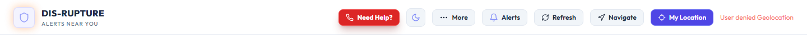                    | Use theme-aware gradient stops (dark in light mode) or solid `text-slate-900` in light mode in `App.jsx` L1341 |
| BUG-02 | All-clear banner “X km”         | Light / 1440     | Critical | `text-white` inside `.glass-panel` is **not** overridden by `.light-mode`; computed contrast **1:1** on white glass.                                                                                        | **Fail**    | 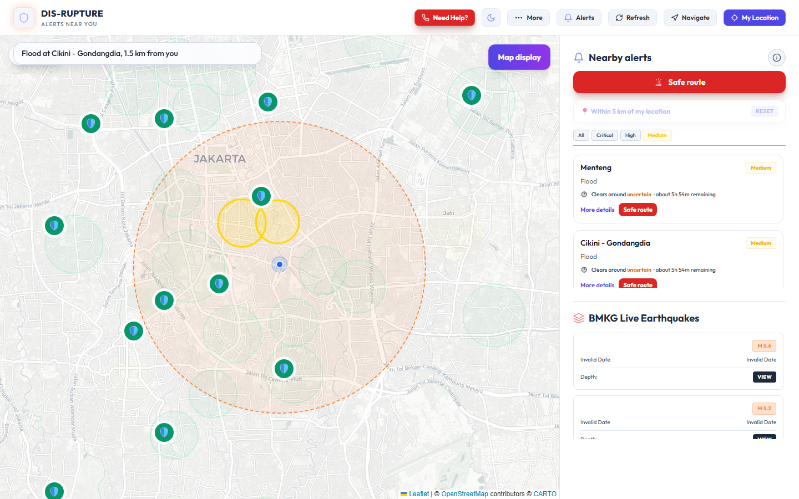                | Replace `text-white` with theme-conditional class in `MapView.jsx` L1712                                       |
| BUG-03 | About modal body                | Light / 1440     | Partial  | Main paragraphs readable (overrides apply). Footer “Disruption Score” explanation is **very small** and low-contrast.                                                                                       | **Partial** | 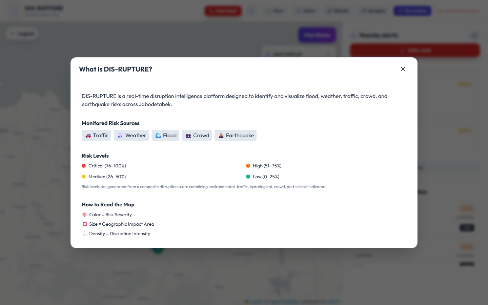                | Pass `theme` to About modal; use explicit light tokens like `EmergencyHelpModal.jsx`                           |
| BUG-04 | Map layer panel inactive labels | Dark / 1440      | Major    | Inactive layer uses `text-slate-600` on dark `glass-panel` — **2.2:1**. Colored overlay labels (e.g. Waterways, Hospitals) also very faint on dark glass.                                                   | **Fail**    | 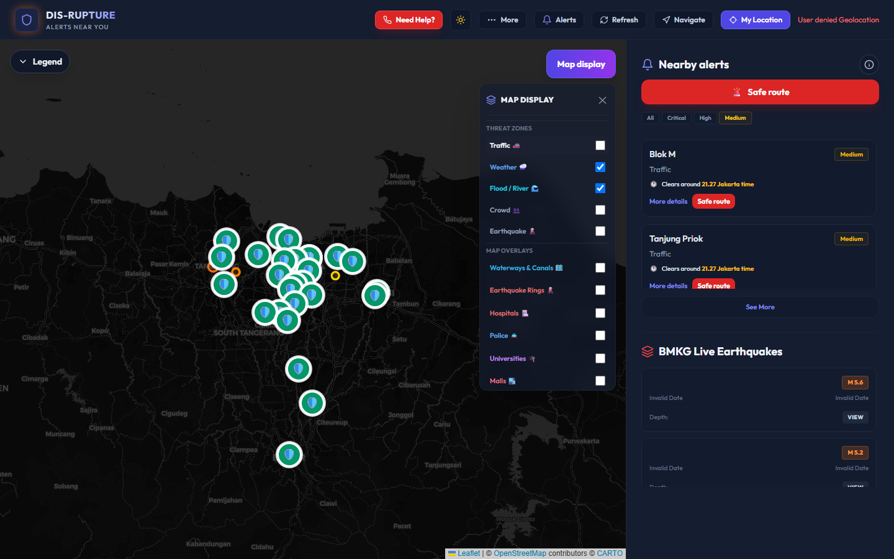   | Use `text-slate-400` when inactive; brighten overlay label colors on dark glass                                |
| BUG-05 | Global theme system             | All              | Major    | Three parallel mechanisms (`theme` prop, `.light-mode !important`, `dark:`) miss classes like `text-white`, `text-slate-500/600`.                                                                           | **Fail**    | —                                                                                            | Consolidate to CSS variables or consistent `theme` prop                                                        |
| BUG-06 | BottomSheet, MlRiskBadge        | Light            | Partial  | Fixed dark Tailwind classes rely on global `.light-mode` overrides; works today but fragile.                                                                                                                | **Partial** | 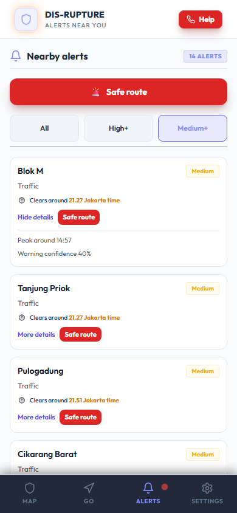          | Branch on `theme` prop explicitly                                                                              |
| BUG-07 | Medium severity badge           | Light / 390      | Critical | `text-yellow-500` on `bg-yellow-500/5` ≈ **1.85:1** — fails WCAG for normal text.                                                                                                                           | **Fail**    | 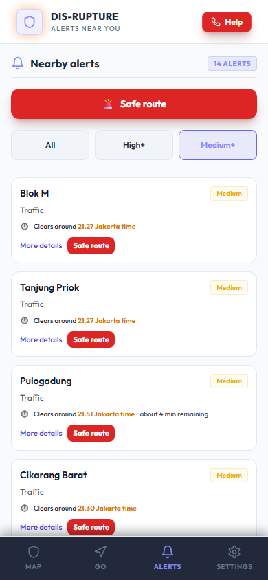                      | Use `text-yellow-700` (light) / `text-yellow-300` (dark) in `AlertCard.jsx`                                    |
| BUG-08 | Medium-risk map yellow          | Light / map      | Major    | `#FFD600` zones and legend swatch low contrast on Carto light tiles.                                                                                                                                        | **Fail**    | 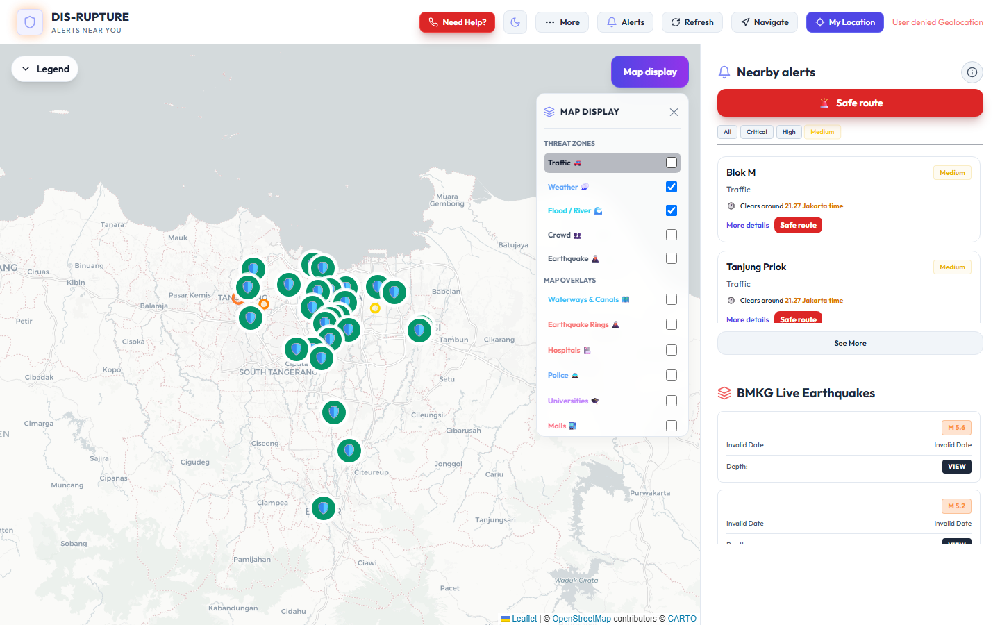 | Darken stroke/fill or add halo for medium zones                                                                |
| BUG-09 | CrowdMeter muted text           | Dark             | Minor    | `text-slate-500` on `bg-slate-800` ≈ **3.1:1** — borderline for small text.                                                                                                                                 | **Partial** | —                                                                                            | Use `text-slate-400` in dark mode in `CrowdMeter.jsx`                                                          |
| BUG-10 | MlRiskBadge loading             | All              | Minor    | `text-slate-600` with no theme branch.                                                                                                                                                                      | **Fail**    | —                                                                                            | Add `isLight` conditional                                                                                      |
| BUG-11 | Evacuation vs BottomSheet       | Mobile / 390     | Major    | Evacuation panel z-1200 sits **under** BottomSheet z-1600 — evacuation UI can be hidden when zone selected.                                                                                                 | **Fail**    | — (code-confirmed)                                                                           | Raise evacuation z-index or collapse sheet during evacuation                                                   |
| BUG-12 | Micro text (9–10px)             | Mobile / all     | Minor    | Nav labels, badges, map legend, admin tables use `text-[9px]`/`text-[10px]`.                                                                                                                                | **Fail**    | 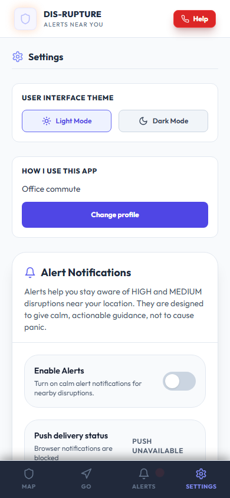                         | Raise minimum to 11–12px for secondary copy                                                                    |
| BUG-13 | Disabled CTA opacity            | All              | Minor    | `disabled:opacity-50` fades entire button including label.                                                                                                                                                  | **Partial** | —                                                                                            | Fade background only; keep label at full opacity                                                               |
| BUG-14 | Keyboard focus                  | Light / 1440     | Major    | Tab through header shows **no visible focus ring** on any control.                                                                                                                                          | **Fail**    |           | Add global `:focus-visible` ring in `index.css`                                                                |
| BUG-15 | Tour replay backdrop            | Light / 1440     | Minor    | Replay uses `bg-slate-900/20` — map UI competes with modal.                                                                                                                                                 | **Partial** | 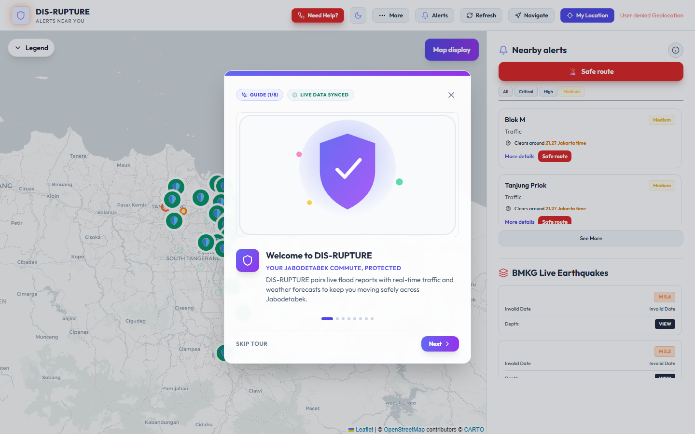                | Increase backdrop opacity in light mode                                                                        |
| BUG-16 | BMKG earthquake cards           | Light / 1440     | Major    | Cards render **“Invalid Date”** in red/gray — confusing and low-trust; date text hard to parse.                                                                                                             | **Fail**    | 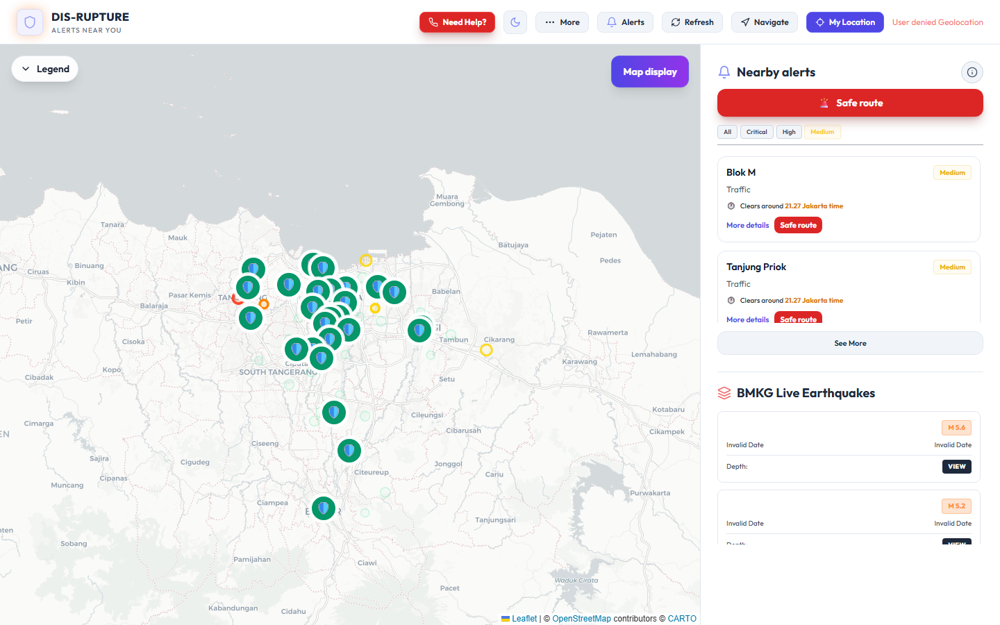               | Fix date formatting; use readable fallback copy                                                                |
| BUG-17 | Geolocation error text          | Light / 1440     | Minor    | Raw “User denied Geolocation” in coral — readable but harsh; not a contrast failure.                                                                                                                        | **Pass**    |                           | Out of scope (usability); human-friendly message                                                               |
| BUG-18 | Emergency modal                 | Light / 390      | Pass     | White on red buttons; list rows readable.                                                                                                                                                                   | **Pass**    | 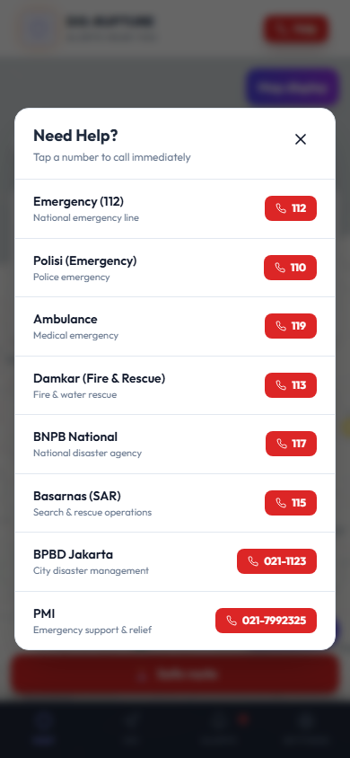          | —                                                                                                              |
| BUG-19 | Notifications modal             | Light / 1440     | Pass     | Theme-aware styling; labels readable.                                                                                                                                                                       | **Pass**    | 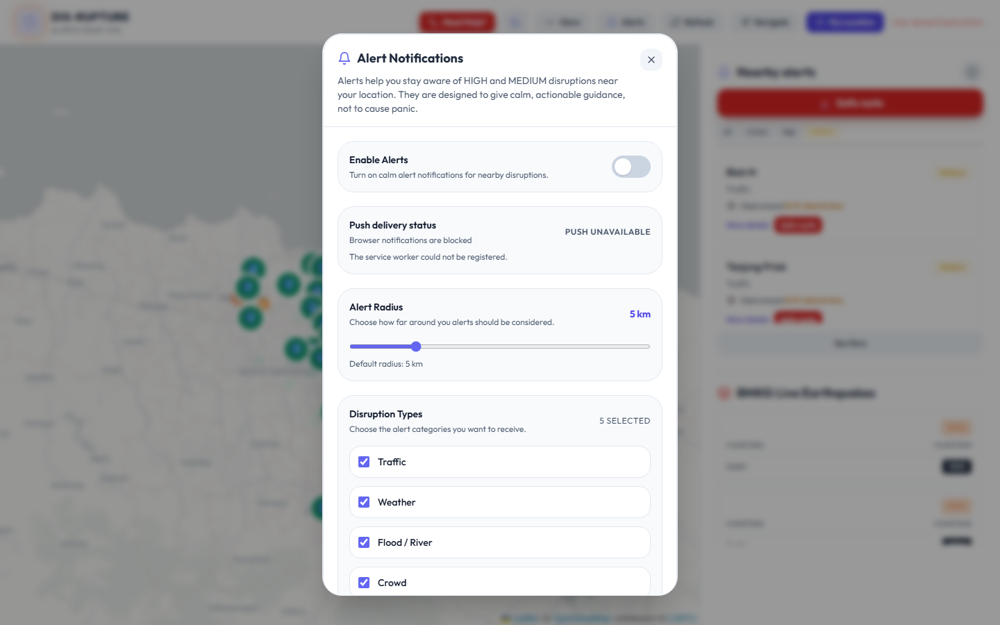      | —                                                                                                              |
| BUG-20 | Dashboard overlay               | Light / 1440     | Pass     | Charts and KPI text readable on dark overlay.                                                                                                                                                               | **Pass**    | 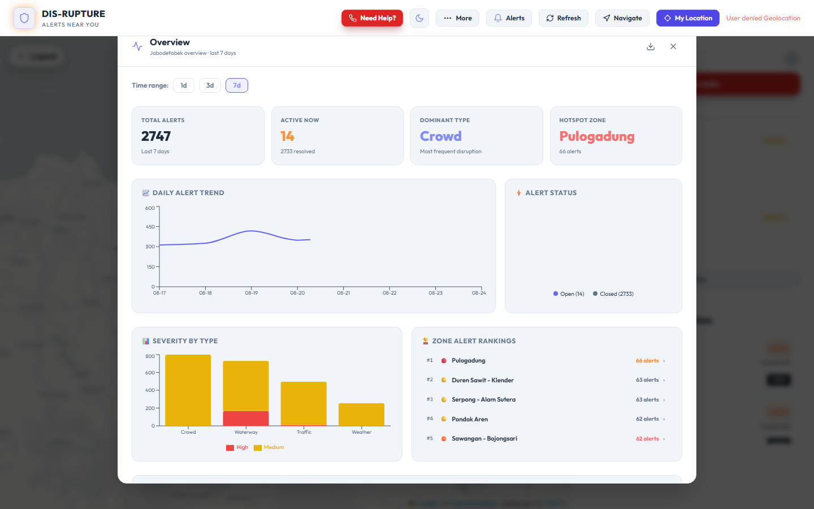            | —                                                                                                              |
| BUG-21 | First-run / persona flows       | Light            | Pass     | Tour and persona picker text readable at 1440 and 390.                                                                                                                                                      | **Pass**    | 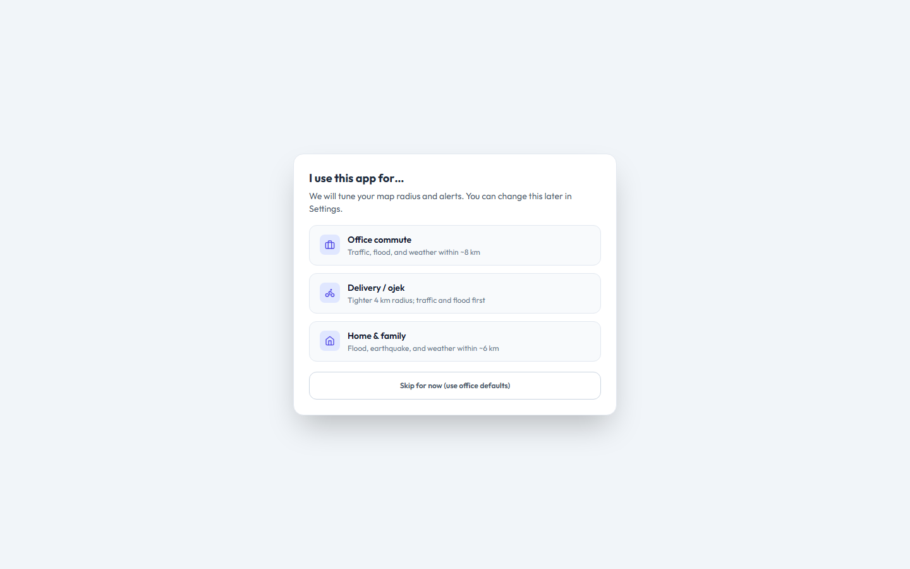               | —                                                                                                              |
| BUG-22 | Admin `/admin`                  | 1440             | Partial  | Login form readable; post-login tables use 9–11px dense text (not fully exercised without credentials).                                                                                                     | **Partial** |                        | Increase table font size; verify glass panels in light admin if added                                          |

---

## 5. Surface coverage matrix

| Surface             | Light desktop | Dark desktop | Light mobile | Dark mobile | Screenshot                                                                         |
| ------------------- | ------------- | ------------ | ------------ | ----------- | ---------------------------------------------------------------------------------- |
| Header + title      | ✓             | ✓            | ✓            | ✓           | `desktop-1440-light-header.png`, `phone-390-dark-header.png`                       |
| Map + sidebar       | ✓             | ✓            | ✓            | ✓           | `desktop-1440-light-map-sidebar.png`, `phone-390-light-map.png`                    |
| Layer panel         | ✓             | ✓            | —            | —           | `desktop-1440-light-layer-panel.png`, `desktop-1440-dark-layer-panel-inactive.png` |
| Near-me / all-clear | ✓             | —            | —            | —           | `desktop-1440-light-near-me-map.png`                                               |
| Bottom sheet        | —             | —            | ✓            | —           | `phone-390-light-bottom-sheet.png`                                                 |
| Alerts feed         | ✓             | —            | ✓            | ✓           | `phone-390-light-alerts.png`, `phone-390-dark-alerts.png`                          |
| Settings            | —             | —            | ✓            | ✓           | `phone-390-light-settings.png`, `phone-390-dark-settings.png`                      |
| Navigate (GO) tab   | —             | —            | ✓            | ✓           | `phone-390-light-navigate.png`                                                     |
| Emergency modal     | ✓             | —            | ✓            | —           | `desktop-1440-light-emergency-modal.png`                                           |
| About modal         | ✓             | —            | —            | —           | `desktop-1440-light-about-modal.png`                                               |
| Notifications modal | ✓             | —            | —            | —           | `desktop-1440-light-notifications-modal.png`                                       |
| Dashboard overlay   | ✓             | —            | —            | —           | `desktop-1440-light-dashboard-overlay.png`                                         |
| First-run tour      | ✓             | —            | ✓            | —           | `desktop-1440-light-first-run-tour.png`                                            |
| Persona picker      | ✓             | —            | —            | —           | `desktop-1440-light-persona-picker.png`                                            |
| Tour replay         | ✓             | —            | —            | —           | `desktop-1440-light-tour-replay.png`                                               |
| Tablet layout       | ✓             | —            | —            | —           | `tablet-768-light-home.png`                                                        |
| Admin login         | —             | ✓            | —            | —           | `desktop-1440-dark-admin-login.png`                                                |
| Keyboard focus      | ✓             | —            | —            | —           | `desktop-1440-light-keyboard-focus.png`                                            |

---

## 6. WCAG contrast notes

Targets: **4.5:1** normal text, **3:1** large/bold text (WCAG 2.1 AA).

| Pair                                      | Ratio  | Target | Result                 | Related issue              |
| ----------------------------------------- | ------ | ------ | ---------------------- | -------------------------- |
| `slate-100` (#F1F5F9) on white header     | 1.10:1 | 4.5:1  | **Fail**               | BUG-01                     |
| `white` on white glass panel              | 1.00:1 | 4.5:1  | **Fail**               | BUG-02                     |
| `slate-300` on `brand-elevated` (#151D30) | 11.3:1 | 4.5:1  | Pass (dark modal)      | BUG-03 dark                |
| `slate-300` on light override (#F1F5F9)   | 1.36:1 | 4.5:1  | **Fail**               | BUG-03 if override applies |
| `slate-600` on dark glass (~#151D30)      | 2.22:1 | 4.5:1  | **Fail**               | BUG-04                     |
| `yellow-500` on `yellow-500/5%` bg        | 1.85:1 | 4.5:1  | **Fail**               | BUG-07                     |
| `slate-500` on `slate-800`                | 3.07:1 | 4.5:1  | **Fail** (normal text) | BUG-09                     |

---

## 7. Recommendations (prioritized)

### P0 — Fix immediately (unreadable)

1. **BUG-02** — `MapView.jsx` L1712: replace `text-white` with `isLight ? 'text-slate-900' : 'text-white'`.
2. **BUG-07** — `AlertCard.jsx` L26: darken medium badge text (`text-yellow-700` / `text-yellow-300`).
3. **BUG-04** — `MapView.jsx` L867: inactive layers `text-slate-400` (dark) / `text-slate-600` (light).

### P1 — Fix soon (hard to read / fragile)

1. **BUG-01** — Theme-aware header gradient in `App.jsx` L1341.
2. **BUG-11** — Reconcile evacuation panel z-index vs `BottomSheet.jsx` L110.
3. **BUG-14** — Global `:focus-visible` styles in `index.css`.
4. **BUG-05/06** — Reduce reliance on `.light-mode` catch-all overrides.
5. **BUG-16** — Fix BMKG date display so cards show readable timestamps.

### P2 — Improve legibility

1. **BUG-12** — Raise minimum secondary font size to 11–12px.
2. **BUG-08** — Adjust medium-risk map color `#FFD600` for light basemap.
3. **BUG-13/15** — Refine disabled-state and tour backdrop opacity.

---

## 8. Audit artifacts

| Artifact               | Path                                                 |
| ---------------------- | ---------------------------------------------------- |
| This report            | `reports/UI-Readability-Audit-Report.md`             |
| Screenshots (35 files) | `reports/screenshots-ui-readability/`                |
| Capture script         | `reports/ui-readability-audit.mjs`                   |
| Contrast metadata      | `reports/screenshots-ui-readability/audit-meta.json` |

---

## 9. Conclusion

The DIS-RUPTURE frontend has **9 confirmed readability failures**, **5 partial issues**, and **8 surfaces that pass** visual checks. The highest-impact defects are **light-mode map banner text** (`text-white` on white glass), **yellow Medium severity badges**, and **dim inactive labels on dark glass map controls**. Keyboard users cannot see focus on header actions. No code changes were made during this audit; apply the P0 recommendations first if you want to proceed with fixes.

---

## 10. Remediation (24 August 2026)

P0 and P1 fixes were implemented in the frontend:

| BUG ID | Status | Change |
|--------|--------|--------|
| BUG-01 | Fixed | Theme-aware header title (`text-slate-900` in light mode) in `App.jsx` |
| BUG-02 | Fixed | Theme-conditional km text in `MapView.jsx`; `.light-mode .glass-panel .text-white` safety rule in `index.css` |
| BUG-03 | Fixed | About modal uses explicit light/dark tokens in `App.jsx` |
| BUG-04 | Fixed | Inactive layer labels use `text-slate-500 dark:text-slate-400`; overlay labels respect checked state in `MapView.jsx` |
| BUG-07 | Fixed | Medium badge uses `text-yellow-700` / `text-yellow-300` in `AlertCard.jsx` and map popups |
| BUG-09 | Fixed | `CrowdMeter.jsx` muted text uses `text-slate-400` in dark mode |
| BUG-10 | Fixed | `MlRiskBadge.jsx` loading text uses `dark:text-slate-400` |
| BUG-11 | Fixed | Mobile evacuation panel raised to `z-[1700]` in `App.jsx` |
| BUG-14 | Fixed | Global `:focus-visible` outline in `index.css` |
| BUG-16 | Fixed | `normalizeEarthquake` + `formatEarthquakeWhen` in `utils/formatEarthquake.js`; used in `App.jsx`, `Sidebar.jsx`, `MapView.jsx` |

Post-fix verification screenshots: `reports/screenshots-ui-readability/post-fix/`

### P2 (24 August 2026)

| BUG ID | Status | Change |
|--------|--------|--------|
| BUG-06 | Fixed | `BottomSheet.jsx` — explicit `isLight` branching for header, metadata cards, borders, Medium badge, and close button |
| BUG-08 | Fixed | `MapView.jsx` — medium-risk fill `#E6A800`, stroke `#B8860B`, weight 3.5; legend swatch and headers updated |
| BUG-12 | Fixed | Minimum secondary copy raised to 11–12px in `App.jsx`, `CrowdMeter.jsx`, `BottomSheet.jsx`, `ResolutionBadge.jsx`, `MlResolutionBadge.jsx` |
| BUG-13 | Fixed | Disabled CTAs use background/text fade instead of whole-control opacity in `App.jsx`, `NavigatePanel.jsx`, `AdminDashboard.jsx` |
| BUG-15 | Fixed | `FirstTimeTour.jsx` — light-mode replay backdrop `bg-slate-900/45` (was `/20`) |
| BUG-22 | Fixed | `AdminDashboard.jsx` — table and form micro-text bumped to `text-xs` (12px) minimum |

Build verified: `npm run build` (frontend, 24 Aug 2026).

**Still deferred:** BUG-05 full CSS variable theme consolidation, BUG-17 geolocation error copy (usability).